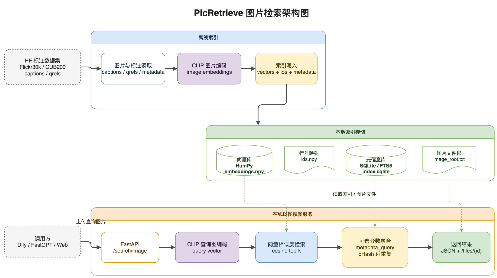

# PicRetrieve

<div align="center">


[](https://github.com/astral-sh/ruff)

</div>

本地相似图片检索 MVP：基于 Hugging Face 上有真实标注的图片检索数据集，离线索引图片，在线通过 CLI 或 FastAPI 做以图搜图、以文搜图和元信息混合检索。第一版不训练模型、不接外部向量数据库，使用 NumPy 暴力余弦相似度。

## 图片检索架构



## 快速开始

```bash
uv sync --extra dev

# 准备 samples/ 文件夹后建索引
uv run python -m app.cli index --image-dir ./samples --data-dir ./data --reset

# 以图搜图
uv run python -m app.cli search-image --image ./samples/query.jpg --data-dir ./data --top-k 5

# 以文搜图
uv run python -m app.cli search-text --text "A black and white dog is running in the grass." --data-dir ./data --top-k 5

# 启动本地 API
uv run uvicorn app.api:app --host 127.0.0.1 --port 8000 --reload
```

打开浏览器访问 `http://127.0.0.1:8000/` 可以使用内置试用页面，支持文本检索和上传图片检索。

## 实际检索示例

当前使用 **OFA-Sys/Chinese-CLIP-vit-base-patch16** 模型，文本编码器基于中文 BERT（支持中英文双语检索），视觉编码器为 ViT-B/16（比旧版 B/32 更强）。

以下示例基于 Flickr30k 测试集（1000 张图片）的预构建索引，展示以文搜图和以图搜图的真实检索效果。所有结果均使用默认 `general` profile。

### 以文搜图

> 文本→图片的 CLIP 余弦相似度通常在 0.50-0.65 区间，下面的例子中 ground truth 图片均排在 #1。

#### 示例 1：人物场景（中文查询）

查询可以输入中文，Chinese-CLIP 自动处理。

```bash
uv run python -m app.cli search-text \
  --text "一个戴耳钉、戴眼镜、戴橙色帽子的男人" \
  --data-dir data/flickr30k_index \
  --model-name data/models/chinese-clip-vit-base-patch16 \
  --top-k 3
```

| 排名 | 图片 | 匹配度 | 描述 |
|---|---|---|---|
| #1 |  | **0.659** | 🎯 戴耳钉的男子，眼镜和橙色帽子 |
| #2 |  | 0.636 | 橙色衬衫、蓝色安全帽的男子 |
| #3 |  | 0.624 | 白胡子老人、眼镜和帽子 |

> 🎯 = ground truth 图片。同义英文查询效果一致（可中英混合使用）。

#### 示例 2：户外工作场景（中文查询）

```bash
uv run python -m app.cli search-text \
  --text "两个人坐在屋顶上，一个人站在梯子上" \
  --data-dir data/flickr30k_index \
  --model-name data/models/chinese-clip-vit-base-patch16 \
  --top-k 3
```

| 排名 | 图片 | 匹配度 | 描述 |
|---|---|---|---|
| #1 |  | **0.632** | 🎯 两人坐在房顶上，一人站在梯子上 |
| #2 |  | 0.553 | 戴帽子白衣男子在脚手架高处擦窗 |
| #3 |  | 0.553 | 白衣男子坐在竹制脚手架旁 |

#### 示例 3：冬季场景（中文查询）

```bash
uv run python -m app.cli search-text \
  --text "一群人站在冰屋前" \
  --data-dir data/flickr30k_index \
  --model-name data/models/chinese-clip-vit-base-patch16 \
  --top-k 3
```

| 排名 | 图片 | 匹配度 | 描述 |
|---|---|---|---|
| #1 |  | **0.655** | 🎯 一群人穿着冬季装备站在冰屋前 |
| #2 |  | 0.532 | 五名雪地摩托车手在雪地列队 |
| #3 |  | 0.527 | 维多利亚风格建筑前的人行道 |

### 以图搜图

图片→图片的 CLIP 视觉相似度分数明显更高（0.80-0.90）。

用一张波士顿梗在草地奔跑的图片作为查询，从 1000 张图中找出最相似的图片：

```bash
uv run python -m app.cli search-image \
  --image data/flickr30k_test/images/flickr30k/test/s0000001.jpg \
  --data-dir data/flickr30k_index \
  --model-name data/models/chinese-clip-vit-base-patch16 \
  --top-k 4
```

**查询图片：**


| 排名 | 结果图片 | 综合分 | 视觉分 | 描述 |
|---|---|---|---|---|
| #1 |  | **0.900** | 1.000 | 🎯 查询图自身 |
| #2 |  | **0.784** | 0.922 | 褐色白胸狗叼着球 |
| #3 |  | **0.783** | 0.922 | 三只狗在草地奔跑 |
| #4 |  | **0.779** | 0.916 | 狗在草地上跑动 |

> 前 4 名全部是与"狗"相关的图片，说明 CLIP 视觉相似度能正确识别同类物体。视觉分 0.90+ 意味着两张图在高维语义空间中非常接近。

### 运行你自己的示例

以上命令在克隆仓库并构建索引后即可直接运行。你也可以用内置的 Web 界面（启动 API 后访问 `http://localhost:8000`）上传自己的图片测试。

## Docker 部署

```bash
docker build -t picretrieve .
docker run --rm -p 8000:8000 -v /path/to/data:/app/data picretrieve
```

也可通过环境变量指定模型和数据目录：

```bash
docker run --rm -p 8000:8000 \
  -v /path/to/data:/app/data \
  -v /path/to/models:/app/data/models \
  -e PICRETRIEVE_MODEL_NAME=data/models/chinese-clip-vit-base-patch16 \
  -e PICRETRIEVE_DATA_DIR=data \
  -e PICRETRIEVE_IMAGE_ROOT=data/images \
  picretrieve
```

## 数据引导

当前数据口径只考虑 Hugging Face 上有真实标注的检索数据集，例如 Flickr30k caption 标注和 MTEB CUB200 qrels 标注；不再使用 50k 级演示语料做展示或评估依据。

```bash
# 安装数据下载依赖
uv sync --extra data --extra dev

# 下载 Flickr30k test 集并生成带 caption 标注的 metadata
HF_ENDPOINT=https://hf-mirror.com uv run python scripts/bootstrap_data.py flickr30k-test \
  --out data/flickr30k_test \
  --max-image-size 512
```

### 标准检索基准

为了看更明确的算法指标，主评测只使用 Hugging Face 上有真实标注的标准 benchmark，不使用商品图、型号词、弱监督标签或 50k 级演示语料做精度依据。

#### 文搜图：Flickr30k

```bash
HF_ENDPOINT=https://hf-mirror.com uv run python scripts/bootstrap_data.py flickr30k-test \
  --out data/flickr30k_test \
  --max-image-size 512

uv run python -m app.cli index \
  --root data/flickr30k_test/images \
  --metadata data/flickr30k_test/metadata.jsonl \
  --data-dir data/flickr30k_index \
  --model-name data/models/openai_clip-vit-base-patch32 \
  --batch-size 64 \
  --reset

uv run python scripts/evaluate_flickr30k.py \
  --data-dir data/flickr30k_index \
  --model-name data/models/openai_clip-vit-base-patch32 \
  --batch-size 128 \
  --top-k 1 5 10 \
  --output data/flickr30k_index/eval_flickr30k.json
```

当前本机实测结果：

- images: 1000
- queries: 5000
- Recall@1: 0.5928
- Recall@5: 0.8424
- Recall@10: 0.9018
- MRR: 0.7037

#### 图搜图：MTEB CUB200

`mteb/cub200_retrieval` 是 query / corpus / qrels 三件套图搜图 benchmark。评测脚本只使用 CLIP 图片向量相似度，不使用 metadata 或 FTS。

```bash
HF_ENDPOINT=https://hf-mirror.com uv run python scripts/evaluate_mteb_image_retrieval.py \
  --repo-id mteb/cub200_retrieval \
  --cache-dir data/benchmarks \
  --model-name data/models/openai_clip-vit-base-patch32 \
  --batch-size 64 \
  --top-k 1 5 10 \
  --output data/benchmarks/cub200_clip_eval.json
```

当前本机实测结果：

- queries: 5794
- corpus: 5794
- Hit@1: 0.5195
- Hit@5: 0.8029
- Hit@10: 0.8835
- MRR: 0.6389

#### 近重复图搜图：Flickr30k 变体

该评测用确定性图片变换测试"同一图片变体找回原图"的稳定性，只作为鲁棒性补充，不作为主语义检索指标。

```bash
uv run python scripts/evaluate_image_benchmark.py \
  --data-dir data/flickr30k_index \
  --model-name data/models/openai_clip-vit-base-patch32 \
  --batch-size 64 \
  --top-k 1 5 10 \
  --output data/flickr30k_index/eval_image_benchmark.json
```

当前本机实测结果：Recall@1 / Recall@5 / Recall@10 均为 1.0000。

## API 示例

```bash
curl -X POST http://127.0.0.1:8000/search/image \
  -F "file=@./samples/query.jpg" \
  -F "top_k=5" \
  -F "profile=general"

curl -X POST http://127.0.0.1:8000/search/text \
  -H "Content-Type: application/json" \
  -d '{"text":"A black and white dog is running in the grass.","top_k":5,"profile":"general"}'
```

可用接口：

- `GET /` — 内置 Web 试用页面
- `GET /health` — 健康检查
- `POST /search/image` — 以图搜图
- `POST /search/text` — 以文搜图
- `GET /items/{id}` — 条目元信息
- `GET /files/{id}` — 图片文件

详细接口文档见 [docs/picretrieve_api.md](docs/picretrieve_api.md)。

## 设计说明

- 默认模型：`data/models/chinese-clip-vit-base-patch16`（支持中英文双语检索）
- 设备选择：`--device` 或 `PICRETRIEVE_DEVICE` 支持 `auto`、`cpu`、`cuda`、`cuda:N`、`mps`
- `auto` 优先级：`mps` > `cuda` > `cpu`；显式指定不可用的 CUDA / MPS 会直接报清晰错误
- 向量存储：`data/embeddings.npy` + `data/ids.npy`
- 元信息存储：`data/index.sqlite`，手动维护 FTS5
- API 文件访问：只允许返回索引时写入 `data/image_root.txt` 的图片根目录内文件
- 注释风格：核心类和函数使用中文 Doxygen 风格注释

## 测试

```bash
uv run pytest
```

这些测试只覆盖本地纯逻辑，不会下载 CLIP 模型。

## 项目结构

```
PicRetrieve/
├── app/              # 核心应用包
│   ├── api.py        # FastAPI HTTP 接口 + Web UI
│   ├── cli.py        # 命令行工具
│   ├── config.py     # 环境变量配置
│   ├── embedder.py   # CLIP 向量编码器
│   ├── index_store.py# SQLite + NumPy 索引存储
│   ├── metadata.py   # 图片元信息扫描
│   └── retrieval.py  # 检索与分数融合
├── scripts/          # 数据引导与评测脚本
├── tests/            # pytest 单元测试
├── docs/             # 文档
├── Dockerfile        # 容器部署
└── pyproject.toml    # 项目元信息与依赖
```

## 参与贡献

参见 [CONTRIBUTING.md](CONTRIBUTING.md)。
