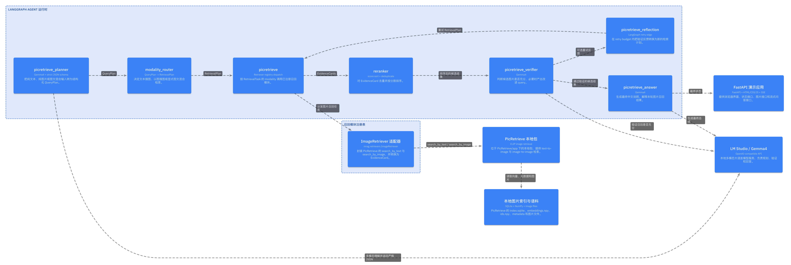

<div align="center">
  <h1>MMRAG</h1>
  <p><strong>基于 LangGraph + PicRetrieve 的本地多模态图片召回 Agent 原型</strong></p>
  <p>
    <a href="docs/getting-started.md"></a>
    <a href="docs/architecture.md"></a>
    <a href="docs/api.md"></a>
  </p>
  <p>
    
    
    
    
    
  </p>
</div>



MMRAG 是一个**先把图片召回模块做真实、再逐步扩展其他模块**的多模态 RAG 原型。当前版本以 PicRetrieve 为第一个可运行模块，使用 LangGraph 编排 Agent 流程，使用本地 OpenAI 兼容多模态模型完成规划、验证和回答生成，并提供一个完整的 FastAPI + 浏览器前端用于演示每一步流水线。

这个仓库关注三件事：

- **真实运行**：不是静态 mock，后端会调用本地 LLM 和 PicRetrieve 索引。
- **过程可见**：前端通过 SSE 展示 Planner、Router、PicRetrieve、Reranker、Verifier、Retry、Answer 每一步的状态和耗时。
- **架构可演进**：当前只启用图片召回，但保留 QueryPlan、RetrievalPlan、EvidenceCard、Retriever Registry 等扩展契约，方便后续增加文本、文档、表格、SQL、知识图谱、音频或视频模块。

## 当前能力

- 文本查图：把自然语言 query 交给 PicRetrieve / CLIP 做图片召回。
- 以图搜图：上传参考图片，直接作为视觉检索输入。
- 图文混合：本地多模态模型先看文字和图片，再决定是否使用图片直检、文本检索或混合检索。
- 流水线追踪：浏览器展示每个 LangGraph 节点的输入摘要、输出摘要、重试次数、阶段耗时和总耗时。
- 架构即代码：LikeC4 维护 C4 架构图，LangGraph 原生图从真实代码导出。

## 快速开始

准备环境：

- Python 3.11+
- `uv`
- Node.js 和 npm
- LM Studio，或其他 OpenAI 兼容的本地 Chat Completions 服务
- 本地 PicRetrieve 数据：`PicRetrieve/data/`

安装依赖：

```bash
uv sync --extra dev
npm install
```

启动本地模型服务。默认配置适配 LM Studio：

```bash
export MRAG_LLM_BASE_URL=http://127.0.0.1:1234/v1
export MRAG_LLM_MODEL=google/gemma-4-26b-a4b
export MRAG_LLM_API_KEY=lm-studio
```

运行原型系统：

```bash
npm run app:dev
```

打开浏览器：

[http://127.0.0.1:8010/](http://127.0.0.1:8010/)

检查运行状态：

```bash
curl http://127.0.0.1:8010/api/status
```

## 文档入口

- [文档总览](docs/README.md)
- [快速开始](docs/getting-started.md)
- [运行配置](docs/configuration.md)
- [数据与索引](docs/data.md)
- [系统架构](docs/architecture.md)
- [API 文档](docs/api.md)
- [开发指南](docs/development.md)
- [LikeC4 架构图维护](docs/likec4_architecture.md)
- [ADR 0001：PicRetrieve 优先的 Agent 原型](docs/decisions/0001-picretrieve-first-agent.md)

## 架构预览

| 视图 | 文件 |
| --- | --- |
| C1 系统上下文 | [docs/likec4/png/index.png](docs/likec4/png/index.png) |
| C2 容器图 | [docs/likec4/png/c2Containers.png](docs/likec4/png/c2Containers.png) |
| C3 Agent 组件图 | [docs/likec4/png/c3AgentComponents.png](docs/likec4/png/c3AgentComponents.png) |
| C4 查询流程图 | [docs/likec4/png/c4QueryFlow.png](docs/likec4/png/c4QueryFlow.png) |
| LangGraph 原生图 | [docs/langgraph/picretrieve_graph.png](docs/langgraph/picretrieve_graph.png) |

## 常用命令

```bash
npm run app:dev          # 启动 FastAPI 演示应用，默认 127.0.0.1:8010
npm run check            # 运行 Ruff 和核心测试
npm run graph:export     # 从真实 LangGraph 代码导出 Mermaid / PNG
npm run arch:dev         # 启动 LikeC4 预览，默认 127.0.0.1:5173
npm run arch:validate    # 校验 LikeC4 模型
npm run arch:export:png  # 导出 LikeC4 PNG 架构图
```

## 仓库结构

```text
mrag/                     # LangGraph、节点、模型契约、召回器适配器、Web UI
PicRetrieve/              # 本地 PicRetrieve 包和测试
architecture/likec4/      # LikeC4 架构源码
docs/                     # 中文文档、架构图、导出产物
docs/likec4/png/          # C4 架构图 PNG
docs/langgraph/           # LangGraph 原生图
scripts/                  # 图导出和维护脚本
tests/                    # MMRAG 集成测试
```

## 数据策略

仓库提交代码、测试、文档和轻量级架构图，不提交本地运行数据。以下内容需要在本机准备：

- `PicRetrieve/data/index.sqlite`
- `PicRetrieve/data/embeddings.npy`
- `PicRetrieve/data/models/`
- 图片语料目录
- Python 虚拟环境
- `node_modules/`

更多说明见 [数据与索引](docs/data.md)。

## 贡献

欢迎围绕“让第一个模块真实可跑、让后续模块容易接入”这个方向贡献。提交前请阅读 [贡献指南](CONTRIBUTING.md)，并运行：

```bash
npm run check
npm run arch:validate
```

## 许可证

MMRAG 使用 [MIT License](LICENSE)。PicRetrieve 子目录包含自己的许可证文件：`PicRetrieve/LICENSE`。
