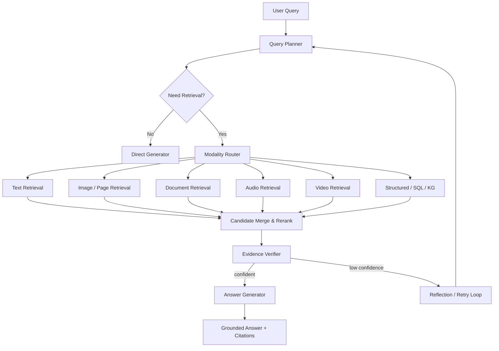

# 多模态检索问答系统技术设计方案

## 1. 设计目标

1. 直接回答：模型内部知识足够时，不强制检索。
2. 检索增强回答：需要外部证据时，调用多路检索。
3. 多跳推理：复杂问题自动拆解、循环检索、逐步聚合证据。
4. 工具增强：OCR、ASR、VLM、SQL、图谱、网页搜索、文档解析等按需调用。
5. 可验证：答案必须能追溯到证据片段、来源和时间戳。

核心原则：
- 先判断是否需要检索，再决定检索什么。
- 先粗召回，再精排，再证据校验。
- 多模态不是把所有模态硬拼一起，而是按任务选择最小充分证据集。
- 支持循环，但要有明确停止条件。

---

## 2. 主流方法取舍


### 2.1 参考的主流方向

- OCR-based RAG：适合纯文档问答，但容易丢布局、图表和视觉线索。
- 原生 MLLM 直答：适合浅层视觉理解，但长文档、多页、多源证据容易超上下文。
- 多向量/晚交互检索：适合页面、图片、版面复杂文档，代表思路可参考 ColPali。
- 多模态 RAG：适合文档、图表、图片混合证据，代表思路可参考 M3DocRAG。
- 反思式/规划式检索：适合复杂问题和自适应检索，代表思路可参考 mR^2AG、CogPlanner、MC-Search。

### 2.2 本方案的选择

采用三层模式：

1. Direct Mode：模型直接回答。
2. Retrieval Mode：单轮或双轮检索后回答。
3. Agentic Mode：多轮规划、检索、反思、再检索。

这样能覆盖大多数业务场景，也方便后续做消融实验。

---

## 3. 总体架构



### 3.1 组件划分

- `Query Planner`：识别意图、任务类型、所需模态、是否多跳。
- `Modality Router`：决定调用哪些检索器和工具。
- `Retriever Layer`：文本、图像、文档、音频、视频、结构化数据并行检索。
- `Reranker Layer`：跨模态重排、去重、证据压缩。
- `Evidence Verifier`：检查证据是否支持答案。
- `Answer Generator`：生成答案、引用和不确定性提示。
- `Memory Store`：会话记忆、工具结果缓存、证据缓存。
- `Telemetry`：记录召回率、工具调用、耗时、失败原因。

---

## 4. 数据与索引层

建议对每种数据建立独立索引，再在检索阶段统一融合。

### 4.1 文本

- 切分为段落、句子、标题层级块。
- 保存稀疏索引（BM25）和稠密向量索引。
- 对长文档保留章节树和元数据。

### 4.2 图片

- 保存全图 embedding。
- 关键区域做 patch / region embedding。
- 可选 OCR 文本、caption、对象标签、OCR 位置框。

### 4.3 文档

- 页面图像 embedding。
- OCR 文本块 embedding。
- 版面结构：标题、表格、图注、公式、列表。
- 图表单独解析，保留图表描述和坐标数据。

### 4.4 音频和视频

- 音频：ASR 转写、说话人分离、时间戳、声学 embedding。
- 视频：关键帧、镜头切分、字幕、场景摘要、时间段 embedding。

### 4.5 结构化数据

- SQL 表、知识图谱、事件图、日志索引。
- 对复杂问句保留 schema 描述和实体链接信息。

---

## 5. 查询处理流程

### 5.1 第一步：意图识别

判断：
- 问的是事实、解释、比较、总结还是多跳推理。
- 是否需要实时知识。
- 是否需要多模态证据。
- 是否需要结构化查询。

### 5.2 第二步：查询重写

生成 1 到 N 个子查询：
- 语义扩展版
- 关键词版
- 模态定向版
- 时序版
- 结构化版

### 5.3 第三步：并行检索

对不同模态并行调用检索器：
- 文本检索器：BM25 + dense retrieval
- 文档检索器：page-level / chunk-level / element-level
- 图像检索器：multivector / late interaction
- 音视频检索器：ASR + segment retrieval
- SQL / KG 检索器：结构化查询

### 5.4 第四步：证据融合

融合时不要简单拼接，建议做：
- 去重
- 来源分组
- 时间排序
- 相关性打分
- 覆盖率检查

---

## 6. 工具调用设计

建议工具层做成可注册的 Tool Registry。

### 6.1 必备工具

- `ocr_tool(image/page) -> text + boxes`
- `asr_tool(audio/video) -> transcript + timestamps`
- `vlm_caption_tool(image/frame) -> caption + tags`
- `layout_parser_tool(document) -> structure tree`
- `table_parser_tool(page/table) -> table cells`
- `chart_parser_tool(chart/image) -> chart schema`
- `vector_retriever(query, modality)`
- `bm25_retriever(query, corpus)`
- `sql_executor(query, schema)`
- `kg_query_executor(query, graph)`
- `web_search_tool(query)`
- `reranker_tool(query, candidates)`
- `evidence_verifier_tool(query, evidence)`
- `answer_writer_tool(query, evidence)`

### 6.2 何时调用工具

- 图片里有文字，先 OCR。
- 文档有表格、公式、图表，先版面解析，再检索。
- 音视频问答，先 ASR 和关键帧抽取，再做多模态检索。
- 结构化问题，优先 SQL/KG。
- 实时性问题，优先外部搜索。

---

## 7. 循环与控制逻辑


### 7.1 检索循环

```
while hop < H_max:
    plan = planner(question, history, evidence)
    if plan.need_clarification:
        return clarify(question)

    subqueries = rewrite(plan)
    candidates = parallel_retrieve(subqueries, modalities)
    ranked = rerank(candidates)
    evidence = verify_and_pack(ranked)

    if evidence.coverage < tau_coverage:
        question = expand_query(question, evidence)
        continue

    if evidence.confidence < tau_conf:
        question = refine_query(question, evidence)
        continue

    answer = generate(question, evidence)
    if not verifier_pass(answer, evidence):
        question = revise_with_error(answer, evidence)
        continue

    return answer
```

### 7.2 推荐的循环点

- 查询重写循环：适合多跳问题。
- 模态扩展循环：文本不够时，自动加图像、视频或结构化检索。
- 证据反思循环：发现证据冲突时，重新检索。
- 生成校验循环：答案不被证据支持时，触发重写。

### 7.3 停止条件

- 达到最大跳数。
- 证据覆盖率足够。
- 答案置信度足够。
- 用户明确要求简答。

---

## 8. 生成层设计

建议把生成分成三步：

1. Evidence Packing：把最相关证据压缩成结构化上下文。
2. Grounded Reasoning：基于证据生成中间推理。
3. Final Answering：输出最终答案和引用。

推荐输出格式：
- 结论
- 依据
- 来源
- 不确定项
- 必要时给出下一步建议

不要把所有检索结果原样塞进上下文，要做证据摘要和证据分层。

---

## 9. 训练与优化建议

### 9.1 基础阶段

- 先做检索器训练和评测。
- 再做 reranker。
- 最后再微调生成模型。

### 9.2 可选训练目标

- 对比学习：提升多模态检索。
- 晚交互学习：提升页面级和元素级召回。
- 反思式监督：学习何时检索、何时停止。
- 证据对齐监督：学习答案必须落在证据上。

### 9.3 可做的合成数据

- 从文档自动构造 QA。
- 从图表和表格自动构造多跳问题。
- 从音视频转写构造时间定位问题。
- 从多源数据构造跨模态对照问题。

---

## 10. 评估方案

### 10.1 检索指标

- Recall@K
- MRR
- nDCG
- Evidence Recall
- Modality Coverage

### 10.2 问答指标

- EM / F1
- 事实一致性
- 引用准确率
- 幻觉率
- 多跳成功率

### 10.3 系统指标

- 平均延迟
- P95 延迟
- 工具调用次数
- 成本
- 回退率

### 10.4 消融实验

- 仅文本 vs 多模态
- 无规划 vs 有规划
- 无反思 vs 有反思
- OCR-RAG vs page image retrieval
- 单轮 vs 多轮
- 无 verifier vs 有 verifier

---

## 12. 技术难点、存在问题与前沿解决方案

本节从研究前沿和工程实践两个角度，分析多模态检索问答系统在落地时最容易遇到的关键问题，并给出可实施的解决方案。

### 12.1 多模态语义对齐困难

**问题表现**

- 文本、图像、表格、图表、音频、视频的语义粒度不同，难以直接放到同一向量空间比较。
- 图像或页面 embedding 往往更偏整体视觉相似，未必能捕获用户问题中的细粒度属性。
- OCR 文本、图像区域、表格单元格和图表元素之间缺少稳定对齐关系。

**前沿实践**

- 使用 CLIP/SigLIP、BLIP、EVA-CLIP、Qwen-VL、InternVL 等视觉语言模型做跨模态表征。
- 对文档页面采用 ColPali / ColQwen 类多向量晚交互检索，而不是只用单一全局向量。
- 对图片、文档页面、表格和图表建立多粒度索引：page-level、region-level、element-level、text-block-level。

**解决方案**

- 采用“多索引并存”策略：同一对象同时保存全局向量、局部向量、OCR 文本向量、caption 向量和结构化元数据。
- 检索时先按模态独立召回，再做跨模态重排，避免过早把不同模态压成一个分数。
- 对图表、表格、版面结构单独解析，形成结构化表示，再参与检索和推理。
- 引入 hard negative mining，让模型学习区分“视觉相似但语义不相关”的样本。

---

### 12.2 文档版面、表格和图表理解不足

**问题表现**

- OCR-based RAG 容易丢失版面、标题层级、图表关系和表格行列结构。
- 多页文档中，答案可能跨页、跨表格、跨图注，普通 chunk 检索很难覆盖完整证据。
- 图表问答需要读取趋势、坐标、图例和数值，不是简单文本检索能解决。

**前沿实践**

- 文档理解逐渐从纯 OCR 管线转向视觉文档检索，即直接把页面当作图像进行检索。
- 多模态文档 RAG 通常使用页面级视觉召回 + OCR 文本召回 + 元素级结构召回的组合。
- 表格和图表任务中，越来越多系统会先把图表转换为中间结构，如 JSON schema、数据表或 chart facts。

**解决方案**

- 建立三层文档索引：
  1. 页面索引：用于快速定位相关页。
  2. 元素索引：表格、图表、公式、图片、标题、图注。
  3. 文本块索引：OCR 段落、标题、页眉页脚。
- 对表格使用 table parser，把单元格、行列标题、合并单元格关系保存为结构化数据。
- 对图表使用 chart parser 或 VLM 提取图表类型、坐标轴、图例、关键数值和趋势。
- 生成答案时强制引用页码、表格编号、图表编号或区域坐标，提高可追溯性。

---

### 12.3 长上下文与长文档扩展性问题

**问题表现**

- 直接把大量文档、图片和视频帧塞给 MLLM，会造成上下文爆炸、延迟高、成本高。
- 长文档问答容易出现“前文遗忘”和“证据淹没”。
- 检索粒度太粗会召回噪声，粒度太细又会丢上下文。

**前沿实践**

- 主流系统倾向于用检索压缩上下文，而不是完全依赖超长上下文模型。
- 多阶段检索越来越常见：粗召回、局部展开、跨模态重排、证据压缩。
- 对长视频和长文档，采用 hierarchical retrieval：先找章节/时间段，再找页面/片段，再找元素。

**解决方案**

- 使用层次化检索：
  - 文档：文档级 -> 章节级 -> 页面级 -> 元素级。
  - 视频：视频级 -> 镜头级 -> 关键帧/字幕片段级。
  - 音频：文件级 -> 说话人段落级 -> 时间戳句子级。
- 设置动态上下文预算，根据问题类型分配给文本、图片、表格、图表和历史对话。
- 引入 evidence packing，把检索结果压缩成“证据卡片”，每张卡片包含来源、内容、模态、置信度和引用定位。
- 对复杂问题采用逐跳检索，每轮只取当前子问题需要的证据。

---

### 12.4 查询意图和模态路由不稳定

**问题表现**

- 用户问题通常不会明确说明要检索哪种模态。
- 系统可能错误地只走文本检索，忽略图片、表格、视频中的关键证据。
- Agentic 检索虽然灵活，但容易过度调用工具，增加成本和延迟。

**前沿实践**

- Agentic RAG / Planner-based RAG 将 LLM 作为查询规划器，动态决定检索路径。
- 近期研究更强调“自适应检索”：不是每个问题都检索，而是先判断是否需要检索、检索什么、检索几轮。
- 工程系统通常会用规则 + 小模型分类器 + LLM planner 混合决策。

**解决方案**

- 设计模态路由器 `Modality Router`，输入用户问题、历史上下文和可用数据源，输出检索计划。
- 使用轻量分类器判断问题类型：事实型、比较型、视觉定位型、表格计算型、时间定位型、多跳型。
- 给工具调用设置预算：
  - 最大检索轮数。
  - 最大工具调用次数。
  - 最大 token / latency / cost。
- 对低置信度路由采用并行召回：文本、页面图像和结构化数据同时召回，再由 reranker 决定证据优先级。

---

### 12.5 跨模态重排和证据融合困难

**问题表现**

- 文本检索分数、图像检索分数、SQL 结果置信度无法直接比较。
- 不同模态证据之间可能互相矛盾。
- Top-K 结果里经常有重复、碎片化或来源不可靠的内容。

**前沿实践**

- 多阶段 reranking 成为标准流程：先向量召回，再用 cross-encoder / MLLM reranker 精排。
- 对复杂问答，证据融合开始引入 contradiction detection、source reliability 和 answer support checking。
- RAG 系统越来越重视 citation precision，即引用是否真正支撑答案。

**解决方案**

- 统一候选证据格式：

```json
{
  "id": "evidence_id",
  "modality": "text|image|page|table|chart|audio|video|sql|kg",
  "source": "file/page/time/table",
  "content": "normalized evidence",
  "raw_ref": "original location",
  "retrieval_score": 0.0,
  "rerank_score": 0.0,
  "support_score": 0.0
}
```

- 采用三段式排序：
  1. 相关性排序：是否回答用户问题。
  2. 支撑性排序：是否能支撑候选答案。
  3. 多样性排序：是否覆盖不同来源和不同模态。
- 对冲突证据触发二次检索或输出不确定性说明。
- 对同一来源的重复片段做聚合，避免把相同证据误认为多个独立证据。

---

### 12.6 幻觉、错误引用和证据不一致

**问题表现**

- 模型可能基于常识补全答案，但证据并未支持。
- 引用位置可能正确，但引用内容不支持结论。
- 多模态场景中，模型可能看错图、读错表格、误解图表趋势。

**前沿实践**

- 研究和产业系统都在引入 answer verification、citation verification 和 self-reflection。
- 部分系统采用“先生成候选答案，再逐句验证”的流程。
- 对高风险问答，使用 verifier 模型或 NLI 模型做证据支持判断。

**解决方案**

- 生成前做 evidence sufficiency check：证据不足时不强答，继续检索或要求澄清。
- 生成后做 sentence-level verification：逐句判断是否被证据支持。
- 引入引用强约束：每个关键结论必须绑定至少一个证据 ID。
- 对图表、表格、数值答案做独立计算校验，避免 VLM 直接读数造成错误。
- 输出“不确定项”和“缺失证据”，把不确定性显式暴露出来。

---


### 12.7 工程成本、延迟和可维护性

**问题表现**

- 多模态模型推理成本高，图像和视频 embedding 存储成本大。
- 多工具链复杂，失败点多。
- Agentic 循环会导致延迟不可控。

**前沿实践**

- 产业系统通常采用级联架构：简单问题走低成本路径，复杂问题才升级到大模型和多模态工具。
- 检索结果缓存、embedding 缓存、工具结果缓存是降低成本的关键。
- 对生产系统，常把 planner、retriever、reranker、generator 拆成可观测服务。

**解决方案**

- 采用分级模型：
  - 小模型做路由、分类、查询重写。
  - 中模型做重排和摘要。
  - 大模型 / MLLM 只处理复杂生成和视觉推理。
- 对离线数据预先解析和建索引，在线阶段只做轻量检索和必要工具调用。
- 设置 SLA 策略：超过时间预算时返回最佳已有证据答案，而不是无限循环。
- 全链路记录 trace，便于定位是 OCR、检索、重排、生成还是验证出错。

---

## 13. 技术框架与模型选型推荐

### 13.1 总体推荐结论

推荐组合如下：

| 层级 | 首选方案 | 备选方案 | 选择理由 |
|---|---|---|---|
| Agent / 流程编排 | LangGraph | Haystack Pipeline、LlamaIndex Workflow | LangGraph 适合状态机、循环、条件边和人工介入 |
| 文档索引与 RAG 抽象 | LlamaIndex | Haystack、RAGFlow | LlamaIndex 的 Document/Node 抽象适合多源文档索引 |
| 向量数据库 | Qdrant | Milvus、Weaviate、pgvector | Qdrant 易部署、过滤强；Milvus 更适合大规模；Weaviate 内置 hybrid 方便 |
| BM25 / 关键词检索 | Elasticsearch / OpenSearch | Weaviate BM25、Postgres FTS | 专有名词、编号、术语检索必须保留稀疏检索 |
| 文档解析 | Docling + PaddleOCR | MinerU、Unstructured、Mistral OCR | Docling 适合本地 RAG；PaddleOCR 适合中文 OCR、表格和版面 |
| 视觉文档检索 | ColQwen2 / ColPali | Voyage multimodal embedding、Jina v4 | 页面级视觉检索适合 PDF、扫描件、图文混排 |
| 文本嵌入 | BGE-M3 | Qwen3-Embedding、OpenAI text-embedding-3-large | BGE-M3 可本地、支持 dense/sparse/multi-vector |
| 文本重排 | BGE-reranker-v2-m3 | Qwen3-Reranker、Cohere Rerank | 中文/多语言可用，便于本地实验 |
| 多模态理解 | Qwen2.5-VL-7B/72B | InternVL3、GLM-4.5V、Claude/Gemini/OpenAI | Qwen2.5-VL 文档、图表、OCR 能力强，且有开源权重 |
| 文本生成 / 推理 | Qwen3、DeepSeek-V3.2 | OpenAI GPT-5 系列、Claude Sonnet/Opus、Gemini 2.5 Pro | 开源模型可复现；闭源模型可作上限对照 |
| 评测与观测 | Ragas + Phoenix | LangSmith、TruLens | Ragas 做指标，Phoenix 做 trace 和错误定位 |


### 13.2 多模态理解 / VLM 模型

| 模型 | 可用方式 | 优点 | 缺点 | 推荐用途 |
|---|---|---|---|---|
| Qwen2.5-VL-7B | 开源 | 中文、OCR、文档、图表较强，可本地实验 | 复杂推理弱于大模型 | 默认本地 VLM |
| Qwen2.5-VL-72B | 开源/API | 文档和图表能力强，接近闭源强模型 | 本地部署成本高 | 强开源 baseline |
| InternVL3 | 开源 | OCR、视觉问答、通用视觉能力强 | 中文文档需实测 | 对比模型 |
| GLM-4.5V | 开源 | 多模态推理能力强 | 部署成本高 | 强 VLM 对照 |
| Claude Sonnet / Opus | API | 长上下文、图像理解、稳健性较好 | 闭源、成本较高 | 闭源上限 |
| Gemini 2.5 Pro | API | 原生多模态、长上下文、视频/音频能力强 | 闭源 | 长视频/长文档上限 |

---
